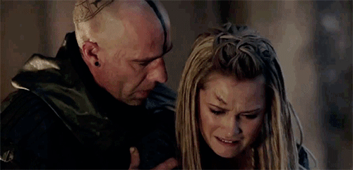
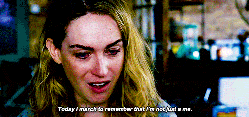

## Bury Your Queers

Note: On television, being a queer female is more deadly than being on the Titanic. Since 1971, when the first lesbian was killed on screen, they've been shot, stabbed, blown up, hit by cars, and poisoned in massive numbers, disproportionate to that of their heterosexual counterparts. An incredibly small percentage get happy endings. In fact, in 2016, over 40 were killed when, on average, the number is usually closer to 5 a year. 

## A Brief History

Note: In 2013, Tracy Levesque and I met at WordCamp SF. In 2014, she and I were at the same hotel for the Community Summit plus Camp, and somehow got to talking about TV in the back of a van. Shay, from Chicago Fire, had just died, and Tracy lamented that we should have some database that listed all the lesbians on TV, and the shows, with if the show was worth it, how good representation was, and of course ... we should power it in WordPress.

## Enter LezWatchTV.com

Note: So we did it. All the existing show data out there was analog, found scattered amongst articles, wikipedia pages, and one-off fan sites. We scoured the Internet and collected as much as possible, because the world needed all the LGBT women characters and their shows in a DB with lots of metadata and taxonomies. But it wasn't that simple. It never is.

## We Needed to Cover...

* Worth Watching?
* Queer Storylines
* Super Queer Episodes

Note: For every show, we realized we needed to do more than just collect the data, we had to make it meaningful. So. How did we determine a show was worth watching? We made a 3-tier, 5-point scale for screen time, realism, and 'good for queers.' Then we gave everything a rating, a simple thumbs up, down, or eeeeeh. Finally we added in extra content for things like the best episodes, or the seasons, so if you only watched a show for queers, you'd know which ones to tune in for. Last month at WordCamp Philly I talked about how prejudging your data ends in painful ways, usually due to Sara Lance. Spoilers? It does here too.

## We Underestimated

Note: Our first iteration of the site had shows and characters with basic info. We only had about 50 shows, but quickly we sorted out how to cross-related two custom post types. One for shows, one for characters. The characters had a dropdown to say which show they belonged to, and we could cross-relate that by matching show IDs... But that got super messy and complicated, super fast. And there were some issues with the design that made responsive and AMP difficult. Plus it had repetitive code. So...

## Stop Hitting Yourself

Note: The primary goal of the redo was mobile first and code updatability. Originally everything was in the theme, and that proved more complicated than it should be. The code was broken out into template parts, with a lot of consideration to DRY code. Things were made hookable, repeatable, echo-able, and so on. Everything had to be portable, so when we moved to another new theme, we could swap it out as painlessly as possible. That meant moving code from the theme to a plugin.

## Sara Lance Hates Me

Note: Then something happened ... We had filled in most of the shows we knew well, and I'd started to collect random ones from Wikipedia. And we found the horrible world of multiple actors with one character. Adding in two people in one text field was okay, but adding it as an array is better because it became searchable in a more robust way. But then Sara flippin' Lance decided two actors wasn't enough. No, she had to be on multiple shows, in multiple roles, AND die and be resurrected. We needed repeatable fields AND groups just because she makes me cry. That's a talk in and of itself, so my brief overview here is that you MUST be willing to be wrong about how you organized data. Just hope you figure that out before you have 1000 characters to edit.

## March 3, 2016 - Lexa

Note: A moment please for the death of Lexa on the 100. See... Queer women on TV had been dying all over forever. For 45 years actually. But never before had it happened while a show was simultaneously touting how in touch it was with the queer community, how much it cared, and how much it wanted us to be happy. Yeah, the 100 baited their fans and paid an unexpected price.

## LGBT Fans Deserve Better

Note: To put it simply, the fans lost their MINDS. It prompted Autostraddle to make a list of all the dead lesbians, starting with 65 and I think it's around 180-something now. We have closer to 300 listed, but because of this, there was suddenly access to more data. And yes, we added them all, with their dates of death. While all that was going on, the fans bought billboards, ads, and made a convention called ClexaCon. They were not going quietly. WE were not going quietly.

## Statistics

See more at [https://lezwatchtv.com/statistics/death/](https://lezwatchtv.com/statistics/death/)

Note: Meanwhile, we'd discovered that with the volume of data we had, we needed to shape it into something meaningful. Having listicles is great, but people need to see what they can do with the data. The raw stats had to be available somehow. I knew from experience that calculating percentages pie charts can be computationally expensive when you do it live, but I also knew I could make it pretty with bar charts and graphs if I used Chart.js and templates.

## Taxonomies vs Custom Post Meta

Note: The challenge with making those stats was that we had to generate them in a way that was easy to process. Some of the data, like sexuality, gender identity, tropes, and cliches, were all in custom taxonomies. That meant to sort out that there were, say, ten characters marked as bisexual out of 100 total? Super easy. But we'd also stored date of death as a custom post meta, so getting a list of how many characters died in 2000 was a lot harder. Post Meta is harder to get at and process en masse. I strongly recommend you use what WordPress has natively as much as possible.

## The Shane Conundrum

Note: Fun story. The L Word, which if you don't know was a groundbreaking show about lesbians ... all the time, had just shy of 70 _NAMED_ queer female characters. You'd think more, to be honest, but that's what we have. The show also has a lot of tropes, like Bury Your Queers, but also Gaybies and all those other old chestnuts. In fact, the show is so filled with over the top plotlines, the characters have so many stereotypical cliches, that you'd think it was written by a tone-deaf white heterosexual man. Spoiler: It was written by a lesbian. And it had so many characters, cliches, and tropes, the page took 30 seconds to load.

## Better Code Runs Faster

Note: It's strange to say this, but having images on a CDN made the site run slower. Once we pulled them all local and rewrote some of our loops, I got the load time down to half-a-second. The peak now is about 90 seconds, which is why we have caching.We're using Varnish with an Nginx proxy and object caching via Memcached Redux. This has the funny effect of making the site way faster live that it is on localhost. I also wrote some fancy varnish code to flush the cache on a show page if you updated a related character, which helped keep everything in sync properly. And then we were ready for phase... whatever. Four?

## RESTful Queerys

Note: Having a faster site is great, but back to the thought about stats. We want to make the data consumable. That is, we want people to be able to access the data they want. Our first plugin is called Bury Your Queers, and it can show who died recently or on a specific day. The same code powers an Amazon Alexa Skill. Yes, using a REST API to power a Bury Your Queers plugin and Amazon Alexa Skill IS funny. You can laugh. But the API let us create a service that didn't put too much stress onto our server. You can ask Alexa who died on a date or most recently. I'm working on the reverse, but apparently "Hey Alexa, ask Bury Your Queers when did Lexa die?" is hard. She can't say Lexa. Who knew?

## Representation Matters

Note: At this point, we also started digging into better ways to find _WHAT_ you want, when you want it. Using a taxonomy is great to get a list of everyone who is, say, an artist. But when you want to find a list of all bisexual, trans women, artists who are also criminals, it gets messier. We bought FacetWP to do this, and I do not regret the choice. Those search pages are some of the most popular, because they let people drill down to find who they're looking for. They let you find you on TV, or as close as we can maybe get.

## The Future

Note: I've managed to export the stats into a JSON output, and we want to have that be easily portable to a CSV so people can download the database and use Excel or whatever to generate their own useful groups of data. This would let researchers and newspapers collect data and make MEANINGFUL articles with real data. We wouldn't be guessing anymore. We'd KNOW. And the thing is ... this knowing is IMPORTANT. Yes, it's just TV, but trans women are being murdered in record numbers this year, and I have a long held belief that what we see on TV normalizes and, in some cases, glorifies behavior in our lives. I can't demand change if I can't prove it's necessary.

## "Lez"Watch TV

Note: Which brings us back to this website. If you can't tell, it's more than JUST lesbians. Once we started adding in trans women, we hit a snag. Do we add queer men who were often mis-identified as lesbians? They're not women, but this happened in the L Word. What about genderqueer and gender-fluid? What about heterosexual trans men and women? What about non-binary? They're not all women, but we felt like they needed to be documented. In the end, we added in more options for gender identity, as well as sexuality and romantic orientation, found code to help us sort by those factors, and the site kept growing.

## The Meaning of Queer

Note: But this caused another problem. And no, I'm not talking about those characters for whom queerness is 'just a phase' or 'a college experiment.' We call the latter 'conditional queerness' by the way, and tracy and I No. I mean Beverly Harris - Roseanne's mom on the same named TV show. Beverly was straight until a big queer reveal! Only we found out at the end she was straight all along and it was just a story written by Roseanne. The REAL queer was her sister Jackie! Oh and this year? 2017? They retconned the retcon. How do you record THAT!? 

## Who Is a Person?

Note: What about Ruby and Sapphire, who are two different people in love who became one? And Jadzia Dax, who was queer, but Ezri Dax wasn't except in an alternate timeline. They're all different people, and yet they're not. Do we count the Dax symbiote on it's own? Because Jadzia died, and Dax lived, moving into Ezri. Ezri was straight. Mostly... Kind of. And that brought up another problem!

## The Meaning of Death

Note: This is one we don't have an answer to quite yet but it's a question as to what does 'dead' mean. Jadzia Dax and Ezri Dax were clearly different people. But what about San Junipero? That's an episode of Black Mirror, where in the lesbians are living their lives in virtual reality, die in the 'real world' and live on happily ever after... In VR. Are they dead? Is Bill Potts from Doctor Who dead? She's now a shape-changing liquid alien.

## Death Is In The Mind

Note: Honestly, we're STILL struggling with what happens when people who regenerate die. And the time-traveling Sara Lance... well she's just Schrodinger's bisexual. She's alive or dead at any one point in time, and spends her days traipsing through time sleeping with women. Which is amusing but so, so hard to codify. The fact that death is as fluid as sexuality is interesting to me on a sociological level, just not a data-recorder one.

## Aliens and Bi-Erasure

Note: Let's not forget the gender swapping aliens on the X-Files, or gay women who become straight men, or straight women who realize they're gay ... Are they bi? We ended up going with "Whatever the character says on screen." but not all shows answer the question. Like the GenderQueer. Can you be in a homosexual relationship if you don't identify as male or female? And yes, Bi-erasure! Shows from 1980 to the early 2000s don't talk about bisexuals. What about how many bisexuals end up with women? It's a pretty low number, by the way. Do we need to record this? HOW can we do this in a meaningful way?

## Don't Panic

Note: I wanted to have a slide with someone screaming, but the best gif was Lito from Sense8. Close. Anyway. At this point in time, if you'd like to picture me screaming at my laptop, scaring my cats and wife, and cursing the very idea of doing anything like this, let alone on WordPress with PHP and JS and all the things I had to do to make this code work... That's why I have short hair now. No. It's not. But thankfully...

## A New Design

Note: We didn't let all that stop us. All summer Tracy and I slaved at a new theme that did things faster, better, and more UX attractively. We took into account speed, faceted search, accessibility, images, load time, memory, and everything in between to make the site better. In the middle of all that, the Wynonna Earp account tweeted about us, so I found out where we reaaaly needed to improve things.

## Conclusion

Note: Take a deep breath. Okay. First of all, there is an impact of seeing all of 'your' people dead on tv. It hurts. A generation of TV watching lesbians were scarred over and over again by seeing their characters, the ones who felt like them, die. Furthermore, MANY, but not all, tropes are harmful. Still, claiming things without data proof is hard, and people did not have access to this data previously. But now we do.

## Over 13% of Queer Females Die on TV

Note: Over 13% of queer females die on TV. Sadly I can't get the stats to tell you what the percentage is of queer females to non-queer on TV globally is. Even IMDB doesn't have that data in a parseable format. I tried. But I do know that a higher percentage of queer females characters die on MOST popular shows on TV right now. Like The Walking Dead. And I know that trans women are dying in record numbers in real life. And I can't help but see these things as related.

## I Will Remember You

Note: So my friend and I made a site where we try to make sense of the deaths of lesbians, forge statistics, and publish a narrative of television and how it represents us. Because we deserve better. And we did it on WordPress because there was nothing else that gave us the flexibility and modularity.